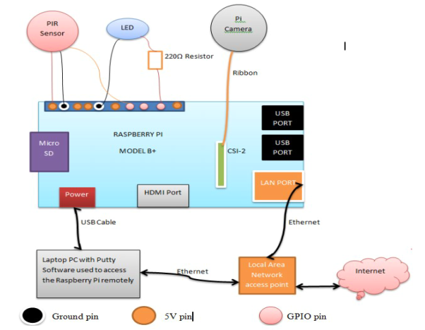
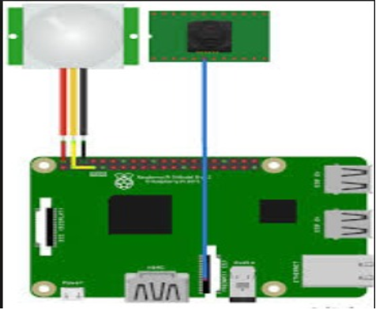

# Rpi-based-Home-security-system

Home security is becoming more and more popular day by day due to its numerous advantages like keeping survelliance of the house from anywhere, anytime. This can be achieved by local networking or by remote control. In this work, a Home Security System is built using PIR Sensor and PI Camera. A PIR sensor is used to detect the presence of any person and a Pi Camera is used to capture the images when the presence it detected. Whenever anyone or intruder comes in range of PIR sensor, PIR Sensor triggers the Pi Camera through Raspberry Pi. Raspberry pi sends commands to Pi camera to click the picture and save it. Then the Raspberry Pi creates a mail and sends it to the defined mail address with recently clicked images. The mail contains a message and picture of intruder as attachment. For the mail the subject is “Intruder Alert”,along with a message stating “Intruder in your house”. Here the pictures are saved in Raspberry Pi with the name which itself contains the time and date of entry. So that we can check the time and date of intruder entry by just looking at the Picture name.

The above architecture and circuit diagram were used to build the home security system.

## Algorithm
1. Install Raspbian OS and copy the same to micro sd card. Create a blank text file named “ssh.txt” and then remove the extension txt to enable ssh communication of rpi3. 
2. Scan for the ip-address of rpi3 and then open putty with same ip address. 
3. Login into putty with its default username and password and then update and upgrade rpi to the latest version to enable interfacing of pi camera module and mail protocols. 
4. Create a python file to write the code. Assign gpio pins for the pir sensor and buzzer and also import all libraries required(camera, mail and gpio). 
5. Check if the output from pir sensor is high, if so then capture a picture of the intruder and attach the same with the date and timestamp in the mail.   
6. Then execute the code using the command python code1.py in this case. 
7. After execution, if there is an intrusion the buzzer will be on for a few seconds & we will get a mail with photo and timestamp attached. 

## Note
While upgrading the raspberry pi, if the power gets disconnected the rpi may get destroyed. To enable ssmtp protocol (mail function to work) we should make the mail account less secured.  
